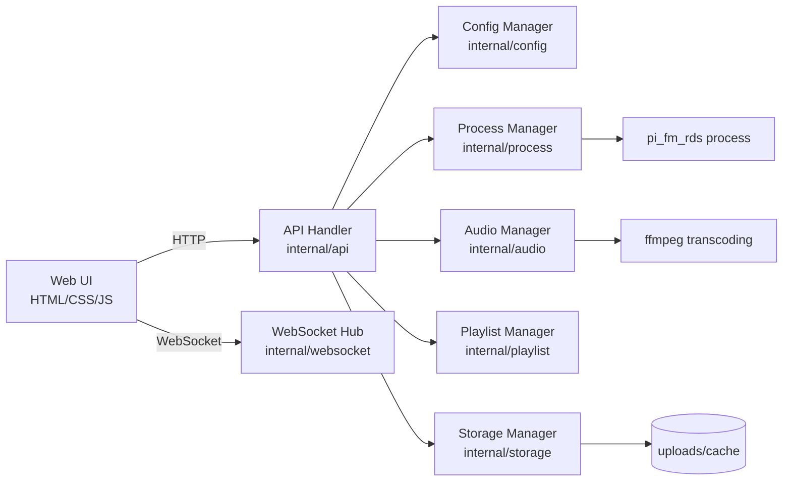

# Pi FM RDS Go

[](https://go.dev/)
[](./LICENSE)
[](https://github.com/liigoo/pi-fm-rds-web)

中文 | [English](#english)


## 中文

Pi FM RDS Go 是一个基于 [PiFmRds](https://github.com/christophejacquet/pifmrds) 的二次开发项目。它并不替代上游 `pi_fm_rds` 的 FM/RDS 发射能力，而是在外面包了一层面向实际使用场景的 Go 服务与 Web 控制台，把原本偏底层、命令行式的广播流程整理成可视化、可管理、可扩展的操作界面。

你可以把它理解为：
- 上游 `PiFmRds` 负责底层 FM/RDS 发射能力
- 本项目负责服务封装、文件管理、播放控制、播放队列、频率调节和频谱可视化
- 最终提供一个更适合树莓派长期运行和日常操作的 Web 化控制层

项目核心目标：
- 在 `PiFmRds` 外层提供一套更易用的可视化控制壳层
- 用现代 Web UI 简化 `pi_fm_rds` 的使用门槛
- 通过 API + WebSocket 提供可编排、可扩展的控制能力
- 适配树莓派实机场景（部署目录、音频转码、进程管理）

## 功能特性

- 频率控制：87.5 ~ 108.0 MHz，支持滑块/输入/旋钮联动
- 播放控制：播放、暂停、停止、上一曲、下一曲
- 文件管理：上传、列表、删除
- 队列管理：加入队列、移除、拖拽排序、顺序播放
- 自动转码：非 WAV 音频自动转码为可播放格式
- 实时频谱：WebSocket 推送频谱数据并在前端渲染
- 健康检查与状态接口：便于自动化运维与集成

## 快速开始

### 1) 环境要求

- Raspberry Pi（推荐开启 GPIO4 发射场景）
- Go 1.23+
- `pi_fm_rds` 可执行文件（默认 `/usr/local/bin/pi_fm_rds`）
- `ffmpeg`（用于音频转码）

### 2) 本地开发运行

```bash
git clone https://github.com/liigoo/pi-fm-rds-web.git
cd pi-fm-rds-web
go mod download
go run cmd/server/main.go -config ./config.yaml
```

访问：`http://<your-host>:8080`

### 3) 常用命令

```bash
# 测试
go test ./...

# 本机构建
go build -o bin/pi-fm-rds-go ./cmd/server/main.go

# 树莓派 armv7 交叉编译示例
GOOS=linux GOARCH=arm GOARM=7 CGO_ENABLED=0 go build -o pi-fm-rds-server ./cmd/server/main.go
```

### 4) 树莓派部署（推荐使用 systemd）

假设部署目录为 `/data/pi-fm-rds`：

```bash
# 1. 上传二进制与 web 资源
scp pi-fm-rds-server pi@<pi-ip>:/data/pi-fm-rds/pi-fm-rds-server
rsync -avz web/ pi@<pi-ip>:/data/pi-fm-rds/web/
scp config.yaml pi@<pi-ip>:/data/pi-fm-rds/config.yaml
scp systemd/pi-fm-rds-go.service pi@<pi-ip>:/tmp/pi-fm-rds-go.service

# 2. 安装并启用 systemd 服务
ssh pi@<pi-ip> 'sudo mv /tmp/pi-fm-rds-go.service /etc/systemd/system/pi-fm-rds-go.service && sudo systemctl daemon-reload && sudo systemctl enable --now pi-fm-rds-go'

# 3. 查看状态
ssh pi@<pi-ip> 'systemctl status pi-fm-rds-go --no-pager'
```

如果你只是临时调试，也可以直接运行：

```bash
ssh pi@<pi-ip> '/data/pi-fm-rds/pi-fm-rds-server -config /data/pi-fm-rds/config.yaml'
```

## 配置说明

默认配置文件：`config.yaml`

关键项：
- `server.host` / `server.port`
- `pifmrds.binary_path` / `pifmrds.default_frequency`
- `storage.upload_dir` / `storage.transcoded_dir`
- `websocket.spectrum_fps`

支持环境变量覆盖：
- `SERVER_PORT`
- `SERVER_HOST`
- `PIFMRDS_BINARY_PATH`
- `PIFMRDS_DEFAULT_FREQUENCY`

## API 概览

- 健康检查：`GET /api/health`
- 状态：`GET /api/status`
- 频率设置：`POST /api/frequency`
- 播放控制：
  - `POST /api/playback/play`
  - `POST /api/playback/pause`
  - `POST /api/playback/stop`
  - `POST /api/playback/next`
  - `POST /api/playback/prev`
- 文件：
  - `POST /api/files/upload`
  - `GET /api/files`
  - `DELETE /api/files/{id}`
- 队列：
  - `POST /api/playlist/add`
  - `GET /api/playlist`
  - `POST /api/playlist/reorder`
  - `DELETE /api/playlist/{id}`
- WebSocket：`GET /ws`

## 项目架构



目录结构：

```text
cmd/server         # 程序入口
internal/api       # HTTP API 与业务编排
internal/audio     # 音频输入/频谱/转码
internal/process   # pi_fm_rds 进程控制
internal/playlist  # 播放队列管理
internal/storage   # 上传与文件存储
internal/websocket # WS 连接与广播
web/               # 前端模板与静态资源
systemd/           # systemd 服务模板
scripts/           # 安装与辅助脚本
```

## 使用到的开源项目

- [PiFmRds](https://github.com/ChristopheJacquet/PiFmRds) - FM/RDS 发射核心能力
- [Go](https://go.dev/) - 后端语言与标准库生态
- [gorilla/websocket](https://github.com/gorilla/websocket) - WebSocket 通信
- [gopkg.in/yaml.v3](https://pkg.go.dev/gopkg.in/yaml.v3) - 配置解析
- [stretchr/testify](https://github.com/stretchr/testify) - 测试断言
- [FFmpeg](https://ffmpeg.org/) - 音频转码支持

## 致谢

特别感谢 **PiFmRds** 原作者 **Christophe Jacquet** 及社区贡献者。  
本项目本质上是围绕上游 `PiFmRds` 做的二次开发与外层封装：保留其底层 FM/RDS 发射能力，在其外面增加 Go 服务、HTTP API、WebSocket、文件管理、播放队列和可视化控制界面，以便更适合实际部署和日常使用。

## 许可证

本项目使用 [MIT License](./LICENSE)。

---

## English

Pi FM RDS Go is a secondary-development project built on top of [PiFmRds](https://github.com/christophejacquet/pifmrds). It does not replace the upstream `pi_fm_rds` FM/RDS transmission engine; instead, it wraps that low-level capability with a Go service layer and a web-based control console, turning a command-line oriented workflow into a visual, operable, and extensible broadcasting system.

In practice:
- upstream `PiFmRds` provides the core FM/RDS transmission capability
- this project adds the outer service layer, file management, playback control, playlist orchestration, frequency tuning, and spectrum visualization
- the result is a Raspberry Pi friendly visual control shell for daily operation and long-running deployment

Core goals:
- Build a usable visual control layer around `PiFmRds`
- Lower the operational barrier of `pi_fm_rds` with a modern web interface
- Provide extensible control via HTTP APIs + WebSocket
- Fit real Raspberry Pi deployment scenarios (paths, transcoding, process control)

## Features

- Frequency control: 87.5 ~ 108.0 MHz (slider/input/knob linked)
- Playback controls: play, pause, stop, previous, next
- File management: upload, list, delete
- Playlist management: enqueue, remove, reorder, sequential playback
- Auto transcoding: non-WAV sources are converted for playback compatibility
- Real-time spectrum: streamed through WebSocket
- Health and status endpoints for automation and ops

## Quick Start

### 1) Prerequisites

- Raspberry Pi (GPIO4-based transmission setup recommended)
- Go 1.23+
- `pi_fm_rds` binary (default: `/usr/local/bin/pi_fm_rds`)
- `ffmpeg` for transcoding

### 2) Run locally

```bash
git clone https://github.com/liigoo/pi-fm-rds-web.git
cd pi-fm-rds-web
go mod download
go run cmd/server/main.go -config ./config.yaml
```

Open: `http://<your-host>:8080`

### 3) Common commands

```bash
go test ./...
go build -o bin/pi-fm-rds-go ./cmd/server/main.go
GOOS=linux GOARCH=arm GOARM=7 CGO_ENABLED=0 go build -o pi-fm-rds-server ./cmd/server/main.go
```

### 4) Raspberry Pi deployment (recommended with systemd)

Assuming deployment path is `/data/pi-fm-rds`:

```bash
scp pi-fm-rds-server pi@<pi-ip>:/data/pi-fm-rds/pi-fm-rds-server
rsync -avz web/ pi@<pi-ip>:/data/pi-fm-rds/web/
scp config.yaml pi@<pi-ip>:/data/pi-fm-rds/config.yaml
scp systemd/pi-fm-rds-go.service pi@<pi-ip>:/tmp/pi-fm-rds-go.service
ssh pi@<pi-ip> 'sudo mv /tmp/pi-fm-rds-go.service /etc/systemd/system/pi-fm-rds-go.service && sudo systemctl daemon-reload && sudo systemctl enable --now pi-fm-rds-go'
ssh pi@<pi-ip> 'systemctl status pi-fm-rds-go --no-pager'
```

For one-off debugging, you can still run the server directly:

```bash
ssh pi@<pi-ip> '/data/pi-fm-rds/pi-fm-rds-server -config /data/pi-fm-rds/config.yaml'
```

## Configuration

Default config file: `config.yaml`.

Key fields:
- `server.host`, `server.port`
- `pifmrds.binary_path`, `pifmrds.default_frequency`
- `storage.upload_dir`, `storage.transcoded_dir`
- `websocket.spectrum_fps`

Environment overrides:
- `SERVER_PORT`
- `SERVER_HOST`
- `PIFMRDS_BINARY_PATH`
- `PIFMRDS_DEFAULT_FREQUENCY`

## API Overview

- Health: `GET /api/health`
- Status: `GET /api/status`
- Frequency: `POST /api/frequency`
- Playback:
  - `POST /api/playback/play`
  - `POST /api/playback/pause`
  - `POST /api/playback/stop`
  - `POST /api/playback/next`
  - `POST /api/playback/prev`
- Files:
  - `POST /api/files/upload`
  - `GET /api/files`
  - `DELETE /api/files/{id}`
- Playlist:
  - `POST /api/playlist/add`
  - `GET /api/playlist`
  - `POST /api/playlist/reorder`
  - `DELETE /api/playlist/{id}`
- WebSocket: `GET /ws`

## Open Source Dependencies

- [PiFmRds](https://github.com/ChristopheJacquet/PiFmRds)
- [Go](https://go.dev/)
- [gorilla/websocket](https://github.com/gorilla/websocket)
- [gopkg.in/yaml.v3](https://pkg.go.dev/gopkg.in/yaml.v3)
- [stretchr/testify](https://github.com/stretchr/testify)
- [FFmpeg](https://ffmpeg.org/)

## Acknowledgements

Huge thanks to **Christophe Jacquet**, the original author of **PiFmRds**, and all upstream contributors.

## License

Released under the [MIT License](./LICENSE).
